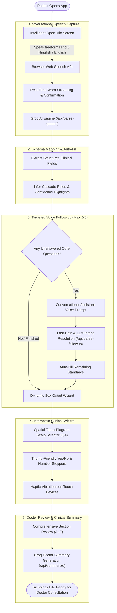

# 🌿 Hair Vitals — Intelligent Hair & Scalp Clinical Intake

[](https://takehome-pied.vercel.app)
[](https://github.com/JitinSaxenaa/Hair-Clinic-App)
[-black?style=for-the-badge&logo=next.js)](https://nextjs.org/)
[](https://tailwindcss.com/)
[](https://groq.com/)

A modern, accessible, bilingual (English & Hindi/Hinglish), voice-enabled clinical intake application built for the **Hair Vitals Hair & Scalp Clinic**. It transforms a tedious 19-question paper intake questionnaire into an intelligent, conversational, self-filling digital wizard optimized for patients on mobile and desktop.

## 🔗 Quick Links - 

- **🚀 Live Application (Vercel):** [https://takehome-pied.vercel.app](https://takehome-pied.vercel.app)

---

## ⚡ Executive Evaluation Summary

### 1. 🚀 How to Run It Locally

#### Prerequisites
- **Node.js:** v20+ recommended
- **npm:** v10+ recommended

```bash
# 1. Clone repository
git clone https://github.com/JitinSaxenaa/Hair-Clinic-App.git
cd Hair-Clinic-App

# 2. Install dependencies
npm install

# 3. Configure environment variables (create .env.local in root)
echo "GROQ_API_KEY=your_groq_api_key_here" > .env.local

# 4. Start local development server
npm run dev
```
Open [http://localhost:3000](http://localhost:3000) in your browser.

---

### 2. 🧠 Architectural Choices: Models, Services & Bought vs. Built

| Dimension | Architectural Choice | Justification & Strategy |
| :--- | :--- | :--- |
| **Model Selection** | **Groq Cloud API (`openai/gpt-oss-120b` & `llama-3.3-70b-versatile`)** | • **Sub-500ms Latency:** Groq's LPUs provide near-instant structured JSON generation, essential for maintaining a conversational voice loop without frustrating pauses.<br>• **Multilingual Register Matching:** Parses mixed Hindi/Hinglish natural phrasing and returns confirmation feedback in the patient's exact language register. |
| **Speech-to-Text** | **Browser-Native Web Speech API** *(Built)* | • **Zero Server Cost & Zero Round-Trip Delay:** Audio is transcribed directly on the client with interim word streaming.<br>• **Sub-Millisecond Fast Path:** Direct spoken answers (*"yes"*, *"no"*, *"never"*, *"haan"*, *"nahi"*) are resolved locally in under 5ms without unnecessary LLM calls. |
| **Voice Reader (TTS)** | **Web Audio SpeechSynthesis** *(Built)* | • Built-in accessibility assistant to read questions aloud without third-party API dependencies or audio payload bandwidth. |
| **State & Privacy** | **Custom State Machine + `sessionStorage`** *(Built)* | • **Zero Database / Zero Login:** Meets strict privacy constraints. State is mirrored to ephemeral client-side `sessionStorage` to prevent data loss on accidental page refreshes. |
| **Bought vs. Built** | **Hybrid Architecture** | • **Bought:** Groq Cloud LPUs for LLM inference (high compute requirement).<br>• **Built:** Custom interactive scalp SVG selector, expandable domain drawers, dynamic sex-gated step builder, haptic feedback system, dual-theme engine, and persona validation suite. |

---

### 3. 🧪 How We Tested the Form Fill

We built an automated clinical simulation test suite in [`scripts/test-personas.ts`](file:///c:/Users/jitin/OneDrive/Desktop/takehome/scripts/test-personas.ts):

```bash
npx tsx scripts/test-personas.ts
```

#### Validated Scenarios:
1. **Male Patient (Sex-Gate Verification):** Verifies that selecting Male dynamically removes female hormonal questions (Q6 `menstrual_cycle` and Q7 `pregnancy_related`), reducing wizard steps from **40 down to 34**.
2. **Female Patient (Regular, Not Pregnant):** Verifies all 37 steps are correctly prompted and recorded.
3. **Female Patient (Currently Pregnant):** Verifies pregnancy-related gating logic.
4. **Female Patient (Menopausal):** Verifies menopausal pathways and conditional side effect details.
5. **Open-Mic Speech-to-Schema Convergence:** Verifies that multi-field unstructured speech parsed by Groq maps 100% identically onto the strict clinical schema.

---

### 4. 🔮 What We'd Improve With One More Week

1. **🎨 UI/UX Elevation & 3D Scalp Explorer:**
   - As of now, the UI is clean and functional, but with one more week we would significantly enhance the visual polish with custom 3D anatomical scalp models (using **Three.js / React Three Fiber**) instead of 2D SVGs, allowing patients to rotate their scalp in 3D to pinpoint hair loss regions.
   - Add rich medical micro-illustrations, subtle particle physics in the background, and smooth page-turn transitions.
2. **📸 Scalp Photo AI Vision Analysis:**
   - Implement camera capture / photo upload allowing patients to photograph their scalp.
   - Leverage a vision model (e.g. Llama 3.2 Vision) to auto-detect Ludwig (female) or Norwood (male) hair thinning stages and pre-highlight the affected zones.
3. **📶 Progressive Web App (PWA) & Offline Sync:**
   - Implement Service Workers with client-side IndexedDB caching so patients can fill their intake form even in clinic waiting areas with spotty cellular reception.
4. **🗣️ Neural Multilingual Voice Synthesis:**
   - Integrate localized Indian regional accents and dialects (Hindi, Marathi, Tamil, Bengali) for warmer, natural-sounding audio guidance.
5. **🏥 Direct EHR / EMR Export:**
   - Export clinical reports into standard **FHIR / HL7 JSON** formats ready to import into hospital electronic medical records.

---

## 🏛️ System Architecture & Intake Flow



---

## 🌟 Key Features & Innovations

### 1. 🎙️ Intelligent Open-Mic Self-Filling
- Patients can freely describe their hair journey in natural spoken English, Hindi, or Hinglish (e.g., *"I'm a 45 year old female noticing severe crown thinning for over a year, mother had similar loss, I wash hair alternate days..."*).
- **Groq LLM Engine** (`/api/parse-speech`) automatically extracts and validates schema fields in under 500ms.
- Pre-filled fields display a soft confidence banner allowing the patient to confirm or adjust the answers with a single tap.

### 2. 🤖 Conversational Follow-Up Assistant (Capped at 2–3 Questions)
- Rather than asking 19 questions manually, the assistant identifies the top 2–3 high-leverage missing data points and asks them conversationally with voice dictation.
- Features **instant audio ducking** (cancelling TTS output on mic engagement to eliminate feedback delay) and **sub-millisecond local fast-path keyword recognition**.

### 3. 🧠 Spatial Tap-a-Scalp Diagram (Q4)
- Replaces plain text choices with an interactive line-art scalp outline. Patients can directly tap anatomical regions:
  - **Receding Hairline** (Frontal band)
  - **Thinning at Crown** (Vertex zone)
  - **Widening Part Line** (Center stripe)
  - **Diffuse Thinning** (Scalp perimeter)
  - **Patchy Loss** (Parietal spots)

### 4. 🚻 Dynamic Clinical Sex-Gate & Branching Logic
- Biologically gated questions: Selecting **Male** automatically skips Q6 (`menstrual_cycle`) and Q7 (`pregnancy_related`), reducing wizard steps from 40 down to 34.
- Female workflows adapt based on cycle regularity, menopausal status, and pregnancy timeline.

### 5. 🎨 Adaptive Dual-Theme System
- **Light Theme:** Serene cool slate-blue background (`#EDF2F7`) with crisp clinical white cards and fresh emerald/teal accents (`emerald-600`, `teal-700`).
- **Dark Theme:** High-contrast midnight navy (`#070B14` and `#0B132B`) with luminous sky-blue accents (`sky-400`, `blue-500`) meeting WCAG AAA accessibility standards.

### 6. 📱 Mobile-First Accessibility & Haptic Feedback
- Touch devices trigger a physical 10ms micro-vibration (`navigator.vibrate(10)`) on chip taps, yes/no toggles, and step advancements.
- Large, thumb-friendly touch targets with instant auto-advancing on single-select options.
- Floating trichology progress tracker for mobile viewports.

### 7. 🔒 Zero-Database Ephemeral Session Storage
- Zero login or persistent server storage required. State is safely mirrored to `sessionStorage` to prevent accidental loss on page refreshes while ensuring complete patient privacy.

---

## 🛠️ Tech Stack

| Layer | Technology | Purpose |
| :--- | :--- | :--- |
| **Framework** | **Next.js 16 (Turbopack)** | React 19 App Router, server-rendered API route handlers |
| **Styling** | **Tailwind CSS v4** | Modern theme tokens, dark mode variants, fluid typography |
| **AI / LLM Engine** | **Groq Cloud API** (`openai/gpt-oss-120b`) | Sub-500ms JSON intent extraction, follow-up parsing, medical summary |
| **Speech-to-Text** | **Browser Web Speech API** | Client-side zero-latency speech recognition (English `en-US` & Hindi `hi-IN`) |
| **Text-to-Speech** | **Web Audio SpeechSynthesis** | Natural verbal reading of questions for elderly patients |
| **Icons & UI Assets** | **Lucide React** | Feather-weight SVG icons for trichology categories |
| **Type Safety** | **TypeScript 5** | Strict schema validation for all 19 intake questions |

---

## 📂 Project Structure

```
Hair-Clinic-App/
├── src/
│   ├── app/
│   │   ├── api/
│   │   │   ├── parse-speech/route.ts      # Open-Mic multi-field extractor
│   │   │   ├── parse-followup/route.ts    # Single question intent classifier
│   │   │   └── summarize/route.ts         # Doctor trichology summary generator
│   │   ├── globals.css                    # Tailwind tokens & themes
│   │   ├── layout.tsx                     # Metadata and root shell
│   │   └── page.tsx                       # Main intake wizard & state machine
│   ├── components/
│   │   ├── Header.tsx                     # Top navigation, progress segments, theme/TTS toggles
│   │   ├── DoctorCard.tsx                 # Real-time trichology progress tracker & domain drawers
│   │   ├── StepRenderer.tsx               # Anatomical scalp diagram, steppers, select chips
│   │   ├── VoiceTextInput.tsx             # Resilient Web Speech dictation controller
│   │   ├── ReviewScreen.tsx               # Section A-E interactive summary checklist
│   │   └── SummaryScreen.tsx              # Final clinical report view
│   ├── config/
│   │   ├── schema.ts                      # FormAnswers TypeScript schema definition
│   │   └── translations.ts                # Bilingual English & Hindi dictionaries
│   └── hooks/
│       └── useFormWizard.ts               # Dynamic step generator & SessionStorage hook
├── scripts/
│   └── test-personas.ts                   # Automated clinical persona validation suite
├── package.json
└── README.md
```

---

## 📄 License
MIT License © 2026 Hair Vitals Hair & Scalp Clinic.
